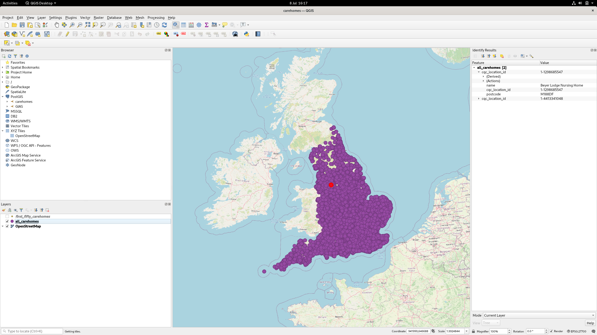
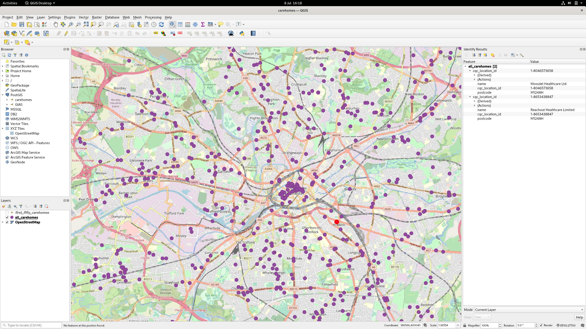

# Carehomes in the UK

This is a proof of concept and joins carehome data from the CQC with postcode info from the ONS.

## Importing the data

The postcodes raw lookup file is too big for Github. You'll need to download
the [ONS's postcode dataset](https://geoportal.statistics.gov.uk/datasets/4f71f3e9806d4ff895996f832eb7aacf)
then extract the file from `Data/NSPL_{MONTH}_{YEAR}_UK.csv` and place it in
`data/postcodes.csv` manually.

